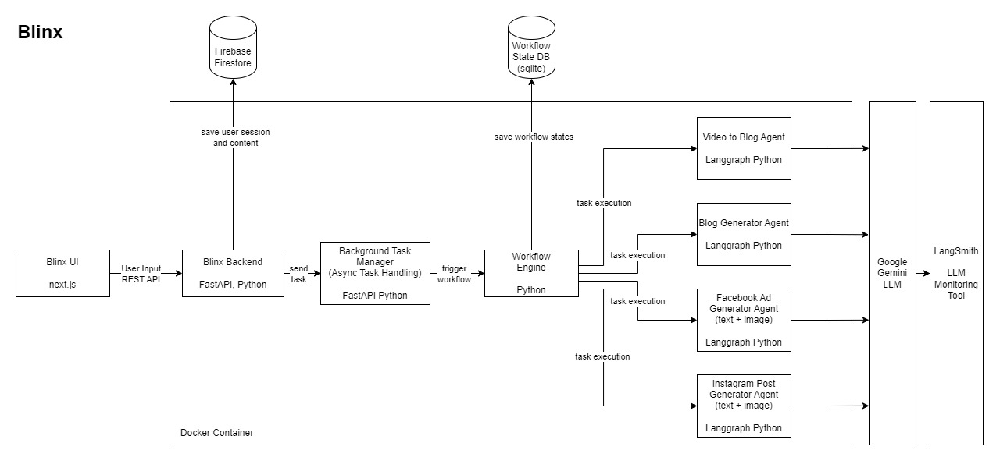

# Blinx - Multi-Agent Generative AI for Content Creation

# Blinx Backend

Blinx is a Generative AI-powered platform that automates personalized text and visual content creation for marketing campaigns. This repository contains the backend code for the Blinx platform, built using **FastAPI** and integrated with **Langgraph agents** to handle various AI-driven workflows.

## Table of Contents
- [Overview](#overview)
- [Features](#features)
- [Tech Stack](#tech-stack)
- [Usage](#usage)
- [API Endpoints](#api-endpoints)

## Overview

The Blinx backend serves as the core API for managing tasks like brand voice identification, content generation (blogs, ad copies, and Instagram posts), and video-to-blog repurposing. The backend handles AI model inference, content management, and task execution.

## Features

- **Brand Voice Identification**: Extracts brand voice and tone from a website using NLP.
- **Blog Creation**: AI-driven blog post generation with human oversight for editing and review.
- **Facebook Ad Copy Generation**: Generates personalized ad copies tailored to specific audience segments.
- **Instagram Post Creation**: Produces visually and contextually aligned content for Instagram posts.
- **Video to SEO Blog Conversion**: Converts videos into SEO-optimized blog articles.
- **Background Task Management**: Handles long-running tasks using FastAPI's background tasks.
- **Polling Mechanism**: Monitors the progress of long-running AI tasks.

## Tech Stack

- **FastAPI**: High-performance API framework for building backend services.
- **Langgraph**: Used for integrating AI agents to handle specific content generation tasks.
- **Python**: Core programming language for the backend.
- **Docker**: Used for containerizing the application.

## Usage

### Prerequisites

- **Python 3.9+**
- **Docker** (optional, if using Docker for deployment)

### Build using docker
Build the Docker image:
`docker build -t blinx-backend .`

Run the container:
`docker run -p --env-file .env 8000:8000 blinx-backend`

## API endpoints
`POST /createBrandPersona`: Generate a brand persona from the given url

`POST /generateBlog`: Starts the blog generation workflow

`POST /resumeBlogGeneration`: For human input during blog generation

`POST /generateAd`: Starts the FB ad generation workflow

`POST /generateInstagramPost`: Starts the Instagram post generation workflow

`POST /analyseVideo`: Starts the video to blog workflow

`GET /taskStatus/{session-id}`: Polling endpoint used for fetching the status of the task

## Architecture

